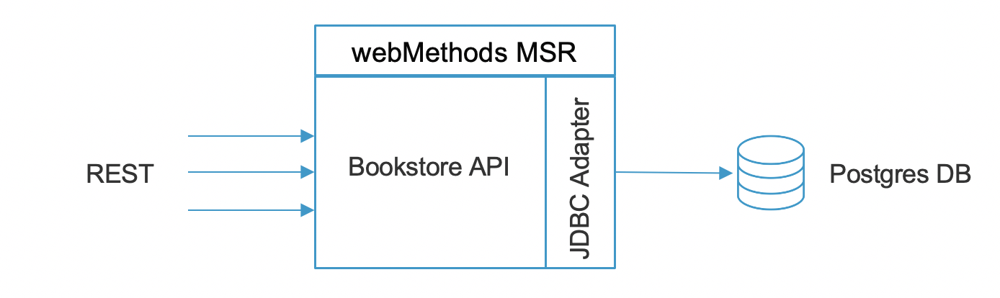

# wmsamples-bookstore-api

A sample webMethods project to demonstrate the quick creation of a CRUD API for a fictional Bookstore

The project leverages:
- Postgres DB as the backend store for the book records.
- webMethods JDBC adapter to access the database
- webMethods REST API layer to easily create the API
- webMethods "flow" to "string" it all together

Here is a simple picture of the deployment:




## Requirements

### Docker desktop / Docker-compose

These should be installed on the desktop of server where you want to run this

### Database JDBC driver

This project leverages a Postgres Database to store data.
As a result, the application needs to make JDBC calls to the backend database.
Instead of storing the JDBC driver in GIT, let's just download the JDBC jar for postgres from https://jdbc.postgresql.org/download.html
And place it in ./assets/sql/postgresql.jar so it can be picked up by the build process and added in the right place downstream.

ie.

```bash
curl https://jdbc.postgresql.org/download/postgresql-42.2.24.jar -o ./libs/postgresql.jar
```

TODO: I will work towards a better way to manage the public JAR dependencies using maven...coming soon.
### License(s)

If you have a license of MSR (which will be required to run the MSR runtime), make sure to download it and add it to the following path:
./assets/licenses/msr-licenseKey.xml
So it can be picked up by the build process and added in the right place downstream.

## Running the project

Review the "docker-compose.yml" file which has the deployment details, including the default users passwords (ie. default user Administrator will have its password set to the value of "$BUILTIN_USER_ADMIN_PASSWORD") and the DB connectivity details.

A simple "up" command will automatically build the images if not already up-to-date, and launch the project:

```bash
docker-compose up -d
```

You can use the "--build" if you want to force a build everytime (should only be needed if you are actively developing the solution...see section below)

```bash
docker-compose up -d --build
```

## Using the APIs

The API swagger file is available at either:
- JSON format: http://localhost:5555/rad/BookstoreAPI:bookstore?swagger.json 
- YAML format: http://localhost:5555/rad/BookstoreAPI:bookstore?swagger.yaml

From there, you can import it in your REST client of choice (ie. Postman https://www.postman.com/downloads/), or simply use CURL...

ie. To call the Bookstore GETALL resource (note: you'll be asked for the basic auth password of the Administrator user, which you can find in the docker-compose.yml file - value of "$BUILTIN_USER_ADMIN_PASSWORD")

```bash
curl -H Accept:application/json -u Administrator http://localhost:5555/rad/BookstoreAPI:bookstore/book
```

## Developing/Updating the package

In order to actually develop/update/improve the package, a developer will need webMethods Designer (standard Eclipse with extra webMethods components / perspectives)
More info on how to download and install designer for free at: 
https://tech.forums.softwareag.com/t/guide-to-download-and-install-webmethods-service-designer-free-download/235210

Before starting the env for the first time (ie. upon initial clone), let's make sure the assets are compiled (ie. class files are built).

Run:

```bash
docker run -v "${PWD}/assets/IS/Packages/BookstoreAPI:/opt/softwareag/IntegrationServer/packages/BookstoreAPI:rw" --entrypoint "/opt/softwareag/IntegrationServer/bin/jcode.sh" harbor.saggs.cloud/library/webmethods-msr-art-jdbc:dev-10.7-latest make BookstoreAPI
```

To start the development environment, simply use:

```bash
docker-compose -f docker-localdev.yml up -d
```

And connect your Designer to the "localhost" server on port 5555.

Then, update your code, and all code changes will automatically be tracked by this GIT directory. 
Don't forget to commit your changes.
